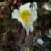
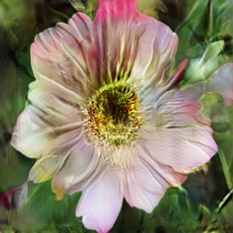

# StackGAN with BERT-Embeddings

Synthesizing high-quality images from text descriptions is a challenging problem in computer vision and has many practical applications. Samples generated by existing text to-image approaches can roughly reflect the meaning of the given descriptions, but they fail to contain necessary details and vivid object parts. In this project, we improve upon the existing Stacked Generative Adversarial Networks (StackGAN) by introducing BERT Embeddings to generate 256×256 photo-realistic images conditioned on captions. 
We divide the problem into two stages. The Stage-I GAN sketches the primitive shape and colours of the object based on the given text description, yielding low-resolution images. The Stage-II GAN takes the primitive results and text descriptions as inputs and generates high-resolution images with photo-realistic details. It can rectify defects in Stage-I results and add compelling details with outstanding refinement process.

### Dependencies
python 3.0 and above

Pytorch 1.6.0
CUDA 10.1

In addition, please `pip install` the following packages:
- `numpy`
- `pandas`
- `torchfile`

## Sample case

### Caption

### Stage-1 Image

### Stage-2 Image

